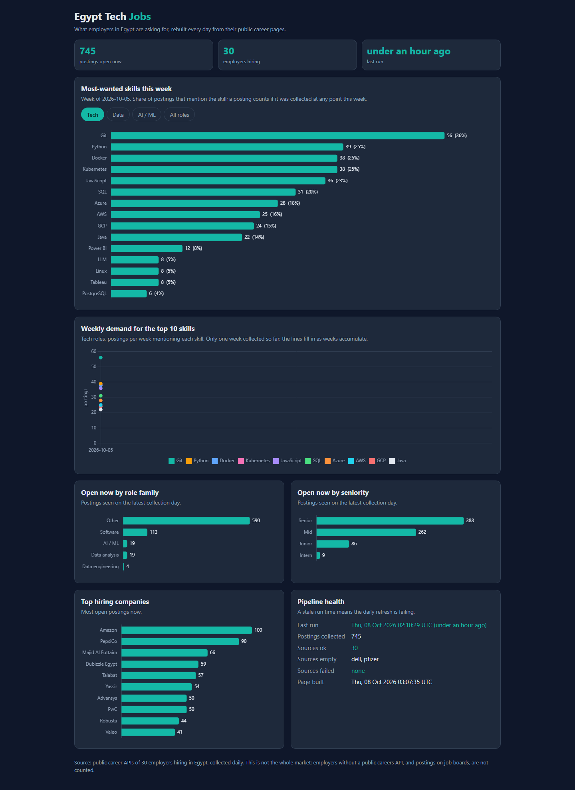
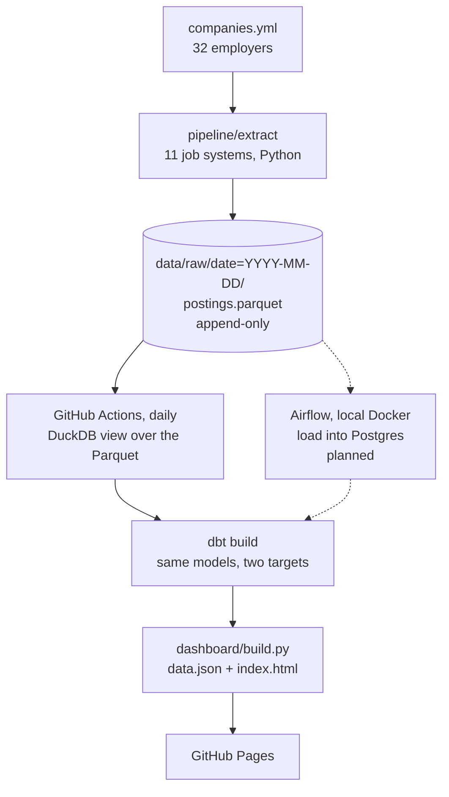

# Egypt Tech Jobs Pipeline

[](https://github.com/mooo-9/egypt-tech-jobs-pipeline/actions/workflows/ci.yml)
[](https://github.com/mooo-9/egypt-tech-jobs-pipeline/actions/workflows/daily.yml)

A data pipeline that collects job postings from 32 employers hiring in Egypt every day, models them with dbt, and publishes a dashboard of which skills and roles are in demand. It runs on GitHub Actions without anyone's machine being on: Python extractors write append-only Parquet files, dbt rebuilds the warehouse from them in DuckDB, and the dashboard is published to GitHub Pages. One mart is also rebuilt independently in PySpark, and CI checks that both give the same rows. If extraction or any dbt test fails, the dashboard is not updated and the previous one stays live. The day's raw data is committed before dbt runs, so a day that fails a dbt test still keeps its files.

**Live dashboard: <https://mooo-9.github.io/egypt-tech-jobs-pipeline/>**



## What the first run found

First run, 2026-10-08. The dashboard updates daily; these numbers are a dated snapshot.

| | |
|---|---|
| Postings collected | 745, from 30 of the 32 employers (Dell and Pfizer had none in Egypt that day). Amazon's list was cut at 100 that day; about 110 were open, and it is now read to the end |
| Open tech postings | 155 (software 113, data analysis 19, AI/ML 19, data engineering 4) |
| Most-asked skills in tech roles | Git 36%, Python 25%, Docker 25%, Kubernetes 25%, JavaScript 23% |

Percentages are the share of open tech postings that mention the skill. Only one collection day exists so far, so the trend chart has a single point; it fills in as days accumulate.

## Architecture



The solid path is what runs today. The dashed Airflow and Postgres path is planned.

A daily run (`.github/workflows/daily.yml`, 04:00 UTC) does this:

1. `python -m pipeline.run` calls every employer's job API and writes that day's `postings.parquet` and a `run_summary.json` (status, rows, error and duration per company, and `truncated` when a capped API listed more postings than were read).
2. The new files are committed to the repo as `data: YYYY-MM-DD`. The commit is the storage layer.
3. `dbt source freshness`, then `dbt build`, run against DuckDB: seeds, models, data tests and unit tests.
4. `python -m dashboard.build` reads the marts and writes the static site.
5. The site is deployed to GitHub Pages.

One employer failing never stops the run. It is recorded in the run summary and shown on the dashboard's health panel. A run where every employer returns zero rows exits non-zero and stops the job.

### Extraction

`pipeline/extract/` has one module per job system, each with `fetch(company, day)`:

| Kind | Systems | Employers |
|---|---|---|
| Large employers' career sites | Workday (10), Oracle Cloud (2), Phenom (2), Eightfold, Jibe, SmartRecruiters, amazon.jobs | 18, including PwC, Oracle, Mastercard, Visa, Ericsson, Valeo, Talabat, BCG, Amazon |
| Tech companies hiring in Egypt | Workable (10), Greenhouse (2), Ashby, Lever | 14, public job-board APIs |

Only postings located in Egypt are kept. Descriptions are fetched only for postings with none stored yet, and each is stored once, in the row for the first day it is known; later rows carry null, and dbt matches skills on each posting's latest stored description. Requests are limited to one per second per host, with a 20-second timeout, three retries with backoff, and a User-Agent that names this repo. Adding a company is a config change in `companies.yml`.

## Data model

DuckDB runs the models in CI and on the daily run. `raw.postings` is a view over `data/raw/*/postings.parquet`, one row per posting per day it was seen.

| Layer | Model | Grain | What it does |
|---|---|---|---|
| staging | `stg_postings` | posting x day | Casts and trims, standardises the city, turns "Posted 3 Days Ago" style strings into dates |
| intermediate | `int_posting_lifecycle` | posting | `first_seen`, `last_seen`, `days_open`, `is_open` (seen on the latest collection day), and `posted_date`, the earliest parsed across its rows (so "Posted 30+ Days Ago" does not move forward each day) |
| intermediate | `int_posting_skills` | posting x skill | Matches title and latest stored description against the `skills` seed (28 regex patterns) |
| intermediate | `int_posting_roles` | posting | `role_family` and `seniority` from the priority-ordered `title_rules` seed |
| marts | `dim_company` | company | Name, industry and source system, from `companies.yml` |
| marts | `fct_postings` | posting | Company, role, seniority, city, lifecycle dates, open flag |
| marts | `fct_posting_skills` | posting x skill | Bridge table |
| marts | `mart_skill_demand_weekly` | week x skill x scope | Open postings mentioning the skill and their share of the scope |
| marts | `mart_role_demand_daily` | day x role family | Open and new postings |

Staging models are views and marts are tables. The seeds are `companies`, `skills` and `title_rules`.

## How each run is tested

| Layer | What is checked |
|---|---|
| Python (72 tests + 6 Spark parity tests) | Each extractor against saved real API responses in `tests/fixtures/http/`, with no network calls, including paging, truncation flags and fields sent as null; the Egypt filter, retries and rate limit; the daily run (one failing company or bad value does not stop it, same-day reruns overwrite only that day, descriptions are stored once); the committed companies seed matches `companies.yml`; the dashboard build; the daily workflow's per-job permissions; the Spark parity tests (see below) are skipped unless PySpark is installed, so they run only in the `spark-parity` job |
| dbt data tests (31) | `unique` and `not_null` on keys, `accepted_values` on `role_family` and `seniority`, `relationships` from both facts to `dim_company`, and singular tests: no posting dated in the future or after it was first seen, skill shares between 0 and 1, the latest run loaded at least one row, no duplicate bridge keys |
| dbt unit tests (9) | Skill matching (including a description stored only on an earlier day), first-rule-wins role classification with defaults, the open/closed lifecycle and the earliest posted date, each on small hand-written inputs |
| Seed pattern cases | `seed_known_cases` runs the real seed regexes over known texts. "R" must not match every capital R and "Go" must not match "Google" or "Go-to-market" |
| Freshness | `dbt source freshness`: warn after 1 day, error after 2 |

On every pull request, CI runs pytest and then `dbt build` against two fixed days of sample data in `tests/fixtures/raw/`, so it never depends on live APIs. A second CI job, `spark-parity`, installs Java and PySpark and runs the Spark parity tests. `dbt build` is 53 steps in total: 1 setup hook, 3 seeds, 9 models, 31 data tests and 9 unit tests.

## Run it locally

You need [uv](https://docs.astral.sh/uv/). The project is pinned to Python 3.12.

```bash
git clone https://github.com/mooo-9/egypt-tech-jobs-pipeline.git
cd egypt-tech-jobs-pipeline
uv venv --python 3.12
uv pip install -r requirements.txt
```

The commands below use `uv run --no-project`, which runs inside that `.venv` without creating a lockfile.

Run the tests. The second command builds the dbt project against the sample data, with no network calls:

```bash
uv run --no-project python -m pytest -q
(cd dbt && RAW_GLOB='../tests/fixtures/raw/*/postings.parquet' DBT_DUCKDB_PATH=ci.duckdb uv run --no-project dbt build --profiles-dir . --target duckdb)
```

Collect real postings, build the warehouse and the dashboard. The collection step calls about 30 employers' APIs and takes about four minutes:

```bash
uv run --no-project python -m pipeline.run
(cd dbt && uv run --no-project dbt source freshness --profiles-dir . && uv run --no-project dbt build --profiles-dir .)
uv run --no-project python -m dashboard.build --db dbt/warehouse.duckdb --raw data/raw --out site
uv run --no-project python -m http.server 8000 --directory site
```

Then open <http://localhost:8000>. The commands are written for bash (Git Bash on Windows).

To add a company on Greenhouse, Lever, Ashby or Workable, check that it has Egypt postings, then add it to `companies.yml` and refresh the seed:

```bash
uv run --no-project python scripts/check_company.py greenhouse tamara
uv run --no-project python scripts/companies_to_seed.py
```

## Spark implementation and parity check

`spark/skill_demand.py` rebuilds `mart_skill_demand_weekly` for `role_scope = 'all'` with PySpark, straight from the raw Parquet files and without dbt. It does the same work as the dbt chain: the posting key and collected date, a Monday week start, skills matched case-insensitively on the title plus the latest non-null description using the patterns in `dbt/seeds/skills.csv`, and each skill's share of all postings open that week. dbt stays the production path, and Spark is not part of the daily run. The job exists as a second, independent implementation: if the two ever disagree, one of them has a bug.

`tests/test_spark_parity.py` builds a warehouse with a real `dbt build` over fixture files, runs the Spark job on the same files, and asserts the rows are identical (week, skill, category and open postings exactly; share to 1e-9). The fixtures include a posting whose description is stored only on its first day, a posting seen on several days of one week, and a week boundary. A second test runs every skill pattern through DuckDB and Spark on awkward strings (vertical tabs, Unicode line breaks, accented neighbours). It found that two things differ between DuckDB's regex engine and Java's: `$` also matches before a final line break in Java, and `\s` also matches a vertical tab. `to_java_regex` fixes both, and the test fails without it. CI runs the parity tests in the `spark-parity` job on pushes to `main`, on pull requests and on manual runs. Run on the real data on 2026-10-08, the Spark job's 27 rows equal the warehouse's.

PySpark is pinned in `requirements-spark.txt` and kept out of `requirements.txt`, so the daily run and the main CI job stay light. It needs Java 21 (Java 19 or later is required for the regex word boundary to match DuckDB's):

```bash
uv pip install -r requirements-spark.txt
uv run --no-project python -m pytest -q tests/test_spark_parity.py
uv run --no-project python -m spark.skill_demand --raw "data/raw/*/postings.parquet" --skills dbt/seeds/skills.csv --out skill_demand.parquet
```

The job runs Spark in local mode. It collects the result through Arrow and writes the Parquet file with pyarrow, because Spark's own writer needs Hadoop's `winutils` on Windows.

## Design decisions

**Full rebuild from append-only Parquet.** The warehouse is rebuilt from every raw file on each run. At a few hundred rows a day this takes seconds, the result is idempotent, and no state carries over between runs, so a bad run is fixed by running again. Raw files are never edited; a rerun on the same day replaces only that day's files.

**Parquet date partitions, committed by the daily run.** GitHub Actions runners keep nothing between runs, so the data has to live somewhere free. Committing each day's zstd Parquet file to the repo gives free storage, a full history that anyone can clone, and keeps the scheduled workflow active (GitHub disables schedules in repos with no activity for 60 days). The first day's file is 0.5 MB, because it holds every posting's description. Later days store a description only for postings seen for the first time: re-running the second day against the first wrote 55 KB (742 of its 755 postings were already known). At that size plus each day's new descriptions, the repo grows by roughly 25 MB a year; if that becomes a problem, yearly compaction is possible.

**One dbt project, two targets.** The same models are meant to run on DuckDB (CI and the daily run) and on Postgres (a planned local Airflow setup in Docker Compose, which will run this same package and dbt project). Only the DuckDB target is exercised so far; the Postgres branches of the macros are written but not run.

**A cross-database regex macro.** Regex syntax differs between the two engines. `regex_match`, `regex_extract` and `parse_posted` use `adapter.dispatch` to pick the right syntax. No model contains database-specific SQL.

**A `tech` scope.** The skills chart defaults to software, data and AI/ML roles, not all roles. In the all-roles view, AWS and Azure each appear in 64 open postings, and 33 of the AWS ones come from a single firm (PwC), mostly on non-technical roles, where the cloud stack is boilerplate. Filtering to tech roles removes most of that distortion. The all-roles view is still one click away.

**Spark only as a check, no Kafka.** The data is about 750 rows a day. DuckDB reads the whole history in seconds on one core, and a batch job that runs once a day has nothing for a message queue to do. Making Spark the production engine, or adding Kafka, would be extra moving parts with no benefit at this size; that is why the Spark job is a parity check and not part of the daily run. At 100 times the volume (tens of millions of rows, many more sources), these things would change first:

- Extraction would be split into parallel tasks per source, with Airflow or a similar scheduler handling retries and backfills.
- Raw files would go to object storage (S3 or GCS) instead of git.
- Models would be incremental, loading only new partitions, instead of a full rebuild.
- The warehouse would move from DuckDB to a managed one (BigQuery, Snowflake or Postgres at scale).
- Spark would only become the engine, and Kafka would only come in, if sources became streams or single-machine memory became the limit. Neither is likely at this volume.

## Data coverage and limits

- The data covers employers with a public career API: 32 employers, 18 large ones and 14 tech companies hiring in Egypt. It is not the whole Egyptian job market.
- LinkedIn and Wuzzuf are excluded on purpose. LinkedIn's terms forbid scraping and it blocks cloud IPs. Wuzzuf sits behind a Cloudflare bot check that a cloud runner cannot reliably pass.
- All data is real and public. It comes from the same endpoints the employers' own careers pages call.
- Roles and seniority come from regex rules on titles, and skills from regex patterns on the title and description. They are deterministic and testable, and they miss some postings and misread some. 590 of the 745 postings in the first run are classed `other` role family, mostly non-technical roles at large employers.
- Eightfold, Oracle Cloud and Phenom return no description in their list calls, so 89 of the 745 postings match skills on the title alone. This undercounts skills for those employers.
- A posting is "open" if it appeared on the latest collection day. A day where an employer's API fails shows up as postings closing.
- No salary data, and no LLM-based extraction: salaries are rarely published in these APIs, and LLM output is costly and not repeatable.

## Repository layout

```
companies.yml           the 32 employers
pipeline/               extractors (extract/) and the daily run (run.py)
dbt/                    models, seeds, macros, tests, profiles.yml
spark/                  PySpark rebuild of mart_skill_demand_weekly, checked against dbt
dashboard/              build.py and the HTML template
data/raw/               date=YYYY-MM-DD/postings.parquet and run_summary.json
scripts/                add-a-company helpers and fixture generators
tests/                  pytest tests and fixtures
requirements-spark.txt  PySpark, needed only for the parity test and the Spark job
.github/workflows/      ci.yml and daily.yml
docs/                   design spec and the dashboard screenshot
```
